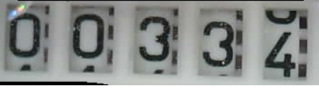
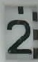
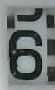
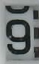
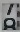

Исходный код модели нейросети взят из репозитория jomjol на Github: https://github.com/jomjol/neural-network-digital-counter-readout
В код внесены некоторые правки для того, чтобы он работал с новыми версиями используемых библиотек

Задача нейросети заключается в определении цифр на изображениях и сопоставлении им соответствующих значений. В случае, если цифру невозможно определить (например, когда барабан счётчика находится между двумя цифрами), нейросеть должна отсеивать изображение (присваивая ему значение NaN).

Счётчик выглядит следующим образом:

  

Нейросеть ставит в соответствие каждому из полученных изображений одно из 11 значений: 10 цифр - от 0 до 9, или NaN

| Picture        | Value           | Picture        | Value           | Picture        | Value           | Picture        | Value           |
| ------------- |:-------------:| ------------- |:-------------:|------------- |:-------------:| ------------- |:-------------:|
|  | 2 |  | 6 | | 9 |  | NaN |

Изображения нейросеть должна получать с изображения с камеры, наблюдающей за счётчиком. Из этого изображения "вырезаются" фрагменты, содержащие цифры, и далее обрабатываются нейросетью.

В папке приложен датасет с примерами (примерно по 150 для каждой из цифр, около 3700 для значения NaN). С помощью кода ImagePreparation они переведены в RGB-изображения с разрешением 32х20. С использованием этого датасета можно легко обучить нейросеть.

Тренировка нейросети производится в ходе выполнения кода Train_CNN_Digital_Readout, реализованного с использованием библиотек TensorFlow и Keras (открытые библиотеки для машинного обучения и взаимодействия с нейросетями). На выходе получаем файл в формате .h5, который можно использовать далее в качестве вводного данного в требующем использования нейросети проекте (например, для считывания данных с счётчика воды или электричества).
